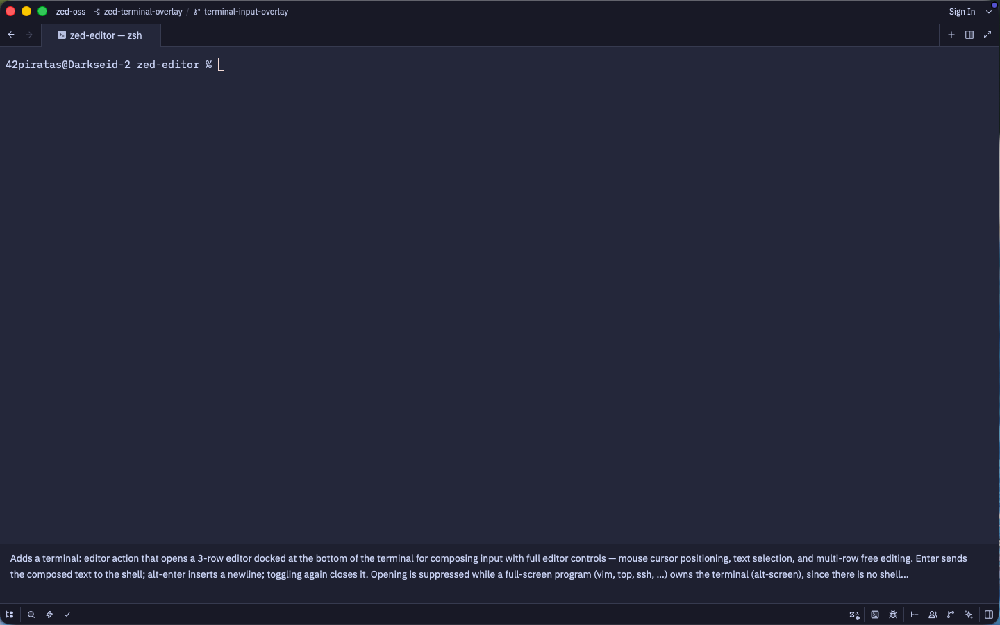
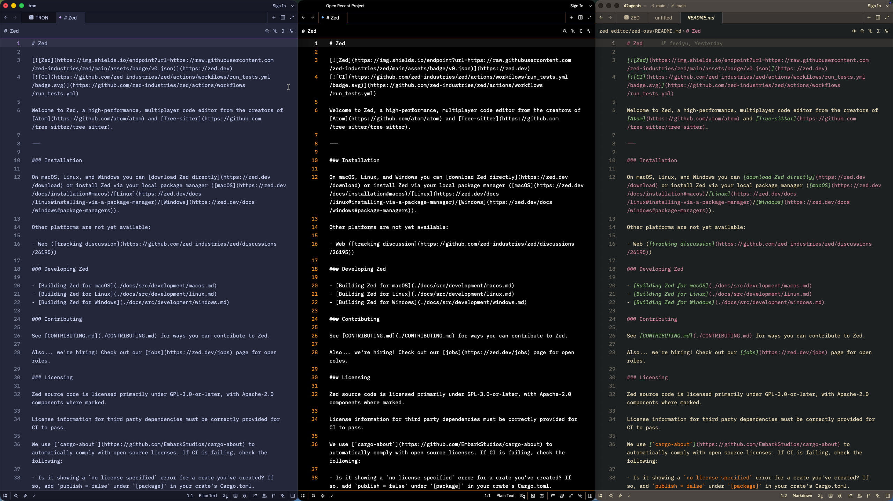
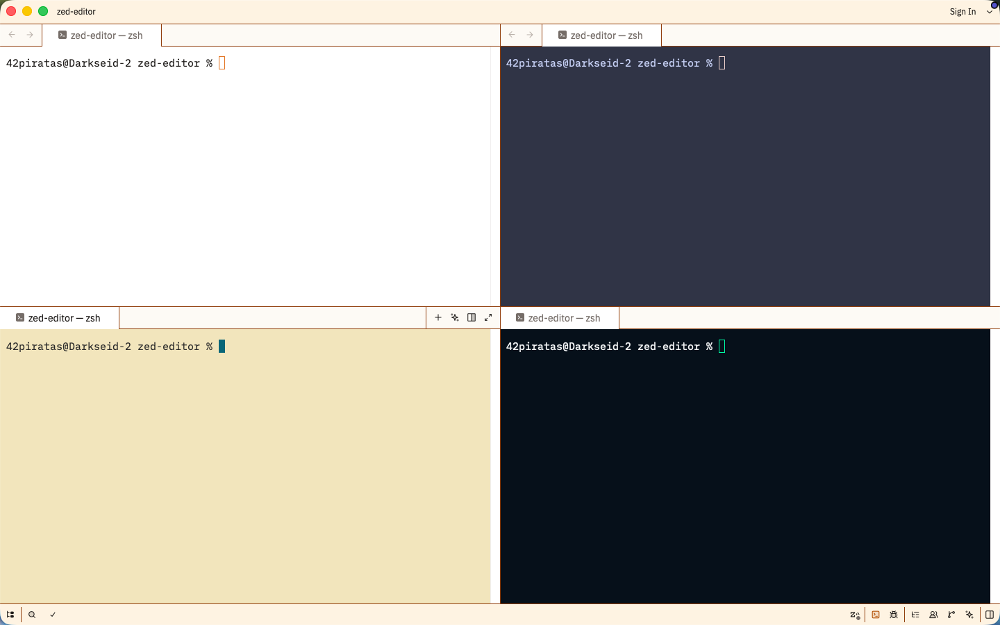
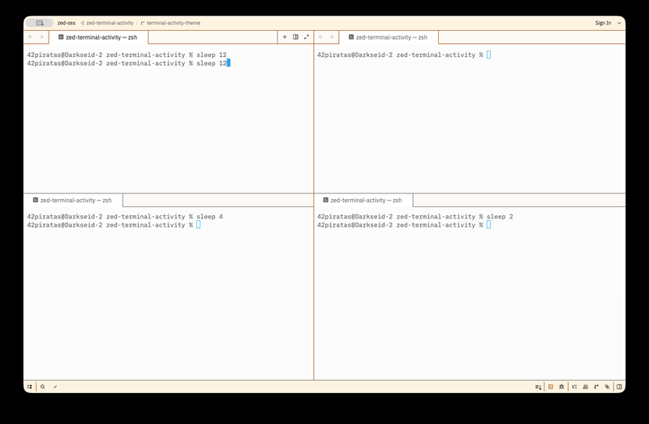

# zed-42labs

My personal [Zed](https://github.com/zed-industries/zed) editor build — upstream Zed plus five features I wrote and proposed back upstream.

## Features

- **`terminal: editor`** — a toggleable multi-line input editor docked at the bottom of the terminal. Compose a command with full editor controls (mouse, selection, multi-line), press Enter to send it to the shell. The composer renders in the terminal's own font, so what you type looks exactly like what lands above it. Upstream PR [#58758](https://github.com/zed-industries/zed/pull/58758).

  
- **`theme: project`** — give each window its own theme, chosen per project and remembered across restarts (stored locally, never written to project files). Upstream PR [#58755](https://github.com/zed-industries/zed/pull/58755).

  
- **`terminal: theme`** — give each terminal its own theme, independent of the window and the global setting. Pick a theme for just the focused terminal (session-scoped). Upstream PR [#58861](https://github.com/zed-industries/zed/pull/58861).

  
- **`terminal: activity theme`** — each terminal switches theme automatically by what it's doing: a *busy* theme while a command runs, an *idle* theme back at the prompt. Interactive programs (editors, REPLs, `claude`, …) are driven by whether output is flowing, not just by being open. Set `terminal.activity_theme: { "busy": "...", "idle": "..." }`; the `terminal: toggle activity theme` command flips it on/off without discarding the names. Built on `terminal: theme`. Upstream PR [#58869](https://github.com/zed-industries/zed/pull/58869).

  
- **`workspace: reset pane sizes`** — a command-palette action that evens out the sizes of all panes in the center split grid, recursing through nested splits while preserving the layout. The same reset was previously reachable only by double-clicking a divider, or via vim's `ctrl-w =`. Upstream PR [#59046](https://github.com/zed-industries/zed/pull/59046).

## Want just the changes?

You don't need this whole fork. The features are in [`patches/`](patches/) as standalone patch files — apply them onto any Zed checkout:

```sh
git am < patches/terminal-editor.patch
git am < patches/per-window-theme.patch
git am < patches/per-terminal-theme.patch
git am < patches/terminal-activity-theme.patch   # apply after per-terminal-theme (it builds on it)
git am < patches/reset-pane-sizes.patch
```

(Patches track the upstream PRs; refreshed when this fork syncs with upstream.)
